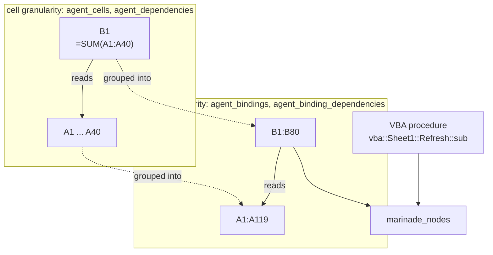

# SQLite schema

`marinade extract` writes a SQLite database. That database — not a Python object,
not an in-memory graph — is the product's interface. Anything you build on top of
XL Marinade (a notebook, a BI dashboard, an LLM agent generating SQL) queries this
file directly.

## Query the views, not the tables

The schema ships two layers:

- **`agent_*` / `marinade_*` views** — the stable, documented query interface.
- **Raw/base tables** — the normalized storage layer underneath. Internal.

The schema itself states the contract ([`schema.sql`](https://github.com/gaspatchio/xl-marinade/blob/main/src/xl_marinade/core/new_arch/schema.sql)):

> These views provide a stable query interface for the documentation agent,
> abstracting the normalized storage schema. Agents MUST access data via views,
> not raw tables, to ensure compatibility across schema versions.

In practice: base tables are free to be renamed, split, denormalized, or
reshaped between releases as extraction logic evolves. The `agent_*` views are
not — they are the compatibility layer that absorbs those changes. **Always
query a view.** If a query you need isn't covered by a view, treat that as a
gap to report, not a reason to reach into the base tables.

## The stable views

Before the per-view detail, the shape of the thing. The extractor records **one
dependency graph at two granularities**, and a node space that spans the
spreadsheet and VBA worlds:



Read it as one graph seen at two zoom levels. Every cell carrying a formula is a
node in the fine-grained graph; cells that share a structure — a column of
uniform formulas, a repeated block — are **grouped into a binding**, and the
edges collapse with them. `B1` reading `A1:A40` and its 79 siblings each reading
a one-row-shifted window become the single edge `B1:B80 → A1:A119`.

Query the **binding** granularity to ask what drives what; that is the level a
human reasons at, and it is thousands of times smaller. Drop to the **cell**
granularity when you need a specific formula or a precise address.

`marinade_nodes` is the union of bindings and VBA procedures — use it when you
want node identity and labels without caring which world a node came from.

**Direction convention:** `from_*` is the formula (the dependent); `to_*` is what
it reads (the precedent). "What drives X" is the set of rows whose `from_*` lies
in X.

### Cells

**`agent_cells`** — every extracted cell, with its formula, value, and format,
denormalized to human-readable addresses. This is the full/heavy variant:
value and format are JSON blobs (can be large across a whole workbook).

Key columns: `cell_address` (`Sheet!A1`), `sheet`, `row`, `col`, `formula`
(the cell's own A1 formula text), `formula_r1c1`, `value` (JSON), `format`
(JSON), `data_type`, `is_array_formula`, `is_spilled`, `cell_id`.

**`agent_cells_light`** — the recommended default for most queries. Same
identity/formula columns as `agent_cells`, minus the `value`/`format` JSON
blobs — cheaper to scan and lighter to transfer.

Key columns: `cell_address`, `sheet`, `row`, `col`, `formula`, `formula_r1c1`,
`data_type`, `is_array_formula`, `is_spilled`, `cell_id`.

**`agent_cells_full`** — alias for `agent_cells`. Use this name when you want
to be explicit in a query that you're intentionally pulling the heavy JSON
payloads.

### Bindings and the model graph

**`agent_bindings`** — bindings are the framework's unit of "a thing on the
sheet worth naming" (a single cell or a rectangular block sharing one
formula pattern), enriched with the label/classification the extractor
inferred for it.

Key columns: `binding_id`, `sheet`, `address` (`Sheet!A1:A10`), `shape_rows`,
`shape_cols`, `binding_type`, `formula_pattern` (R1C1), `label`,
`classification`, `confidence`, `is_orphan`, `extraction_source`,
`spatial_candidates` (JSON), `evidence` (JSON).

**`marinade_nodes`** — a unified node surface: every binding plus every VBA
procedure, in one queryable list of `(node_id, kind, display_name)` triples.
Use this when you want node identity/labels across both the spreadsheet and
VBA worlds without caring which one a node came from; use `agent_bindings`
directly when you need cell-specific fields (shape, address).

Key columns: `node_id`, `node_kind` (`'cell'` or `'procedure'`),
`display_name`, `sheet`, `address`, `binding_type`, `classification`,
`confidence`. VBA node IDs are formatted `vba::<module>::<name>::<kind>`
(with an optional `::<compile_branch>` suffix for `#If`/`#Else` twins) —
split on `::` rather than assuming a fixed token count.

### Dependencies

**`agent_dependencies`** — every precedent/dependent edge between cells,
unioned across the three ways a formula can point somewhere: a single cell,
a range, or an external workbook reference.

Key columns: `from_cell`, `to_cell`, `dependency_type` (`'cell'` | `'range'`
| `'external'`), `cell_count` (range edges only), `to_sheet_id`, `to_r1`,
`to_c1`, `to_r2`, `to_c2` (range bounds; whole-row/column refs appear
pre-expanded, e.g. `A1:A1048576`).

**`agent_binding_dependencies`** — the same dependency graph, but at the
binding level (block-to-block) instead of the cell level, with labels and
addresses resolved for both endpoints.

Key columns: `from_binding`, `from_address`, `from_label`, `to_binding`,
`to_address`, `to_label`, `edge_count`, `kind` (`'formula'` for ordinary
precedent edges, `'via_vba_paste'` for edges synthesised from a VBA
`PasteSpecial`/`.Value = .Value` statement), `provenance_proc` (the VBA
procedure that synthesised a `via_vba_paste` edge, when applicable).

### Labels and structure

**`agent_binding_label_candidate_cells`** — the address-level evidence behind
a binding's inferred `label` (and its group/axis/title candidates) — the
actual header cells the extractor considered, without needing to parse the
JSON evidence blob on `agent_bindings`.

Key columns: `binding_id`, `sheet`, `cell_address`, `candidate_type`,
`candidate_address`, `row`, `col`, `value_text`.

**`agent_table_candidates`** — rectangular regions the extractor identified
as table-like (a header row/column plus a body of matching bindings).

Key columns: `candidate_id`, `sheet`, `range_a1`, `kind` (`'vector'` or
`'grid'`), `confidence`, `r1`, `c1`, `r2`, `c2`, `reasons_top3_json`.

**`agent_formula_families`** — groups of bindings on the same sheet that
share an identical R1C1 formula pattern (e.g. a formula dragged down 200
rows collapses to one family).

Key columns: `family_id`, `sheet`, `formula_r1c1`, `member_count`,
`representative_binding_id`.

### Time axis

**`agent_time_index_candidates`** — bindings the extractor ranked as likely
"time axis" rows/columns (e.g. a projection's year or month header),
ordered by confidence per sheet.

Key columns: `sheet`, `binding_id`, `address_a1`, `rank`, `confidence`,
`reasons_top3_json`.

**`agent_binding_time_annotations`** — for each binding, whether it's
time-dependent and which time-index binding it varies against.

Key columns: `binding_id`, `sheet`, `address_a1`, `time_index_binding_id`,
`is_time_dependent`, `confidence`, `reasons_top3_json`,
`evidence_flags_json`.

## Raw/base tables (internal)

Everything below is the normalized storage layer the views are built from.
**Internal — subject to change; prefer the `agent_*` views above.** Column
names, keys, and even table boundaries here can shift across releases
without a major version bump.

`sheets`, `cells`, `formulas`, `json_blobs`, `bindings`, `binding_edges`,
`cell_to_binding`, `cell_edges_internal`, `cell_edges_external`,
`range_edges`, `user_roots`, `resolution_metrics`, `defined_names`,
`table_candidates`, `table_candidate_members`, `formula_families`,
`formula_family_members`, `binding_label_candidate_cells`,
`time_index_candidates`, `binding_time_annotations`, `data_validations`,
`cell_comments`, `udfs`, `vba_modules`, `vba_procedures`,
`vba_procedure_edges`, `vba_procedure_cell_refs`, `vba_chunks`,
`cell_udf_calls`, plus build-time-only `raw_*` staging tables
(`raw_cells`, `raw_formulas`, `raw_edges_internal`, `raw_edges_range`,
`raw_edges_external`, `raw_json_blobs`) that hold no data once extraction
finishes writing the final tables.

Two of these tables are additive and version-gated: `data_validations` and
`cell_comments` were added later, so databases produced by older extractor
versions won't have them. Capability-check (`sqlite_master`) before querying
either one if you need to support older databases.

## Versioning

The extracted database carries its **own output-schema version**, distinct from
the Python package version. It is stamped into the DB metadata and surfaced as
`schema_version` — and as `schema_version_a`/`schema_version_b` in a
[diff](../guide/diffing.md). It is currently `"3.0"`, and it — not the package
version — governs the stability of the query surface. As stated in the project
changelog, *the SQLite output schema is a versioned public contract*:

- A breaking change to an `agent_*`/`marinade_*` view — a renamed or removed
  view, a renamed or removed column, a changed meaning for an existing
  column — bumps the **major** output-schema version.
- Adding a new view, or a new column at the end of an existing view, bumps the
  **minor** output-schema version.
- The raw/base tables carry **no compatibility guarantee** at any version —
  they can change shape at any time.

The Python package versions separately: `xl_marinade.__version__` follows
[Semantic Versioning](https://semver.org/) for the library API and CLI, and moves
independently of the output schema. Don't confuse the two — a database inspected
in the wild reports its `schema_version`, not the package version. Read the
package version from the installed distribution rather than from documentation:

```python
import importlib.metadata
importlib.metadata.version("xl-marinade")
```

If you're generating queries against this database (by hand or via an LLM),
target the views above and pin to the `schema_version` major — you inherit that
stability guarantee for free.

## Example queries

The outputs below are real, from a small forecast sheet where `A` holds inputs,
`B1:B80` each sums a 40-row window of `A`, and `C1:C71` reads both.

**What drives this output?** The direct precedents of a binding — the query
`Ctrl+[` can't answer across sheets:

```sql
SELECT to_address, edge_count, kind
  FROM agent_binding_dependencies
 WHERE from_address = 'Forecast!C1:C71'
 ORDER BY edge_count DESC;
```

```
Forecast!A1:A119 | 90 | range_static
Forecast!B1:B80  | 80 | range_static
```

`edge_count` is the breadth of the reference — how many populated cells of the
precedent this binding actually reads.

**What does it depend on, all the way back?** The full upstream cone, using
SQLite's recursive CTE:

```sql
WITH RECURSIVE upstream(binding, address, depth) AS (
    SELECT from_binding, from_address, 0
      FROM agent_binding_dependencies
     WHERE from_address = 'Forecast!C1:C71'
    UNION
    SELECT d.to_binding, d.to_address, u.depth + 1
      FROM agent_binding_dependencies d
      JOIN upstream u ON d.from_binding = u.binding
)
SELECT address, MIN(depth) AS depth
  FROM upstream GROUP BY address ORDER BY depth, address;
```

```
Forecast!C1:C71  | 0
Forecast!A1:A119 | 1
Forecast!B1:B80  | 1
```

`UNION` rather than `UNION ALL` is load-bearing: it deduplicates, so a circular
reference terminates instead of looping forever. `MIN(depth)` collapses a node
reachable by several paths — here `A1:A119` is reached both directly and through
`B1:B80` — to its shortest distance.

**What breaks if I change this?** The same query with the join reversed walks
downstream instead:

```sql
SELECT from_address, edge_count
  FROM agent_binding_dependencies
 WHERE to_address = 'Forecast!A1:A119'
 ORDER BY edge_count DESC;
```

```
Forecast!B1:B80 | 119
Forecast!C1:C71 | 90
Forecast!C78    | 20
```

## See also

- [How extraction works](../guide/how-extraction-works.md) — what produces the
  cells/bindings this schema stores.
- [Bindings & the graph](../guide/bindings.md) — the modeling concepts behind
  `agent_bindings` and `agent_binding_dependencies`.
- [CLI reference](cli.md) — `marinade extract` writes this database.
